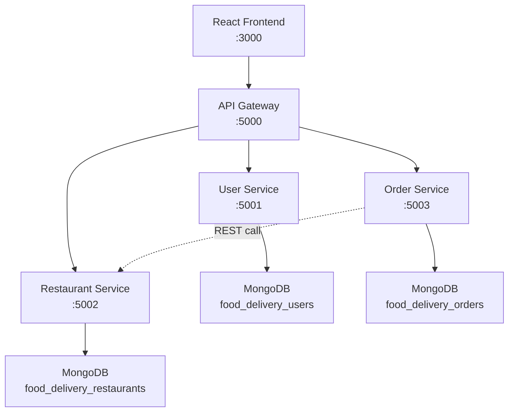

# 🍔 Fast Food Delivery Platform — Walkthrough

## Summary

Generated a **complete microservices-based food delivery application** with 5 components: React frontend, API Gateway, and 3 backend microservices (User, Restaurant, Order). All application code only — zero DevOps content.

## Architecture



## What Was Built

### Backend Microservices

| Service | Port | Files | Key Features |
|---------|------|-------|--------------|
| **User Service** | 5001 | 6 files | Register, Login (JWT), Profile CRUD |
| **Restaurant Service** | 5002 | 5 files | Restaurant CRUD, Menu management, Data seeding |
| **Order Service** | 5003 | 6 files | Place order, Track status, Cancel, Inter-service REST calls |
| **API Gateway** | 5000 | 3 files | Proxy routing, JWT auth on order routes, Morgan logging |

### Frontend (React + Vite)

| Page | Features |
|------|----------|
| **Login** | Split-screen design, JWT auth, toast notifications |
| **Register** | Name, email, phone, password with validation |
| **Restaurants** | Hero with search, cuisine filter chips, skeleton loading, restaurant cards grid, data seeding button |
| **Restaurant Menu** | Banner image, category tabs, quantity controls (+/-), sticky cart preview |
| **Cart** | Item management, delivery address form, payment method (Cash/Card/UPI), order summary with tax calculation |
| **Orders** | Order history with status badges, item previews |
| **Order Tracking** | Step-by-step progress visualization, real-time polling (10s), cancel functionality, ETA display |

### Design System

- **Dark theme** with carefully curated color palette (deep navy/purple backgrounds, orange accents)
- **Glassmorphism** navbar with backdrop blur
- **Micro-animations**: fade-in-up content, shimmer skeletons, pulse on active progress step, hover transforms
- **Google Fonts** Inter for premium typography
- **Fully responsive** with mobile-first breakpoints

## Files Created (35 total)

```
root/
├── README.md                                    # Full documentation
├── api-gateway/
│   ├── .env                                     # Service URLs, JWT secret
│   ├── package.json                             # http-proxy-middleware, jwt, morgan
│   └── server.js                                # Proxy routing to all services
├── user-service/
│   ├── .env / package.json / server.js
│   ├── config/db.js                             # Mongoose connection
│   ├── models/User.js                           # bcrypt password hashing
│   ├── controllers/userController.js            # Register, Login, Profile
│   ├── routes/userRoutes.js
│   └── middleware/auth.js                       # JWT verification
├── restaurant-service/
│   ├── .env / package.json / server.js          # Includes seed endpoint
│   ├── config/db.js
│   ├── models/Restaurant.js                     # Embedded menu items schema
│   ├── controllers/restaurantController.js      # Full CRUD + menu management
│   └── routes/restaurantRoutes.js
├── order-service/
│   ├── .env / package.json / server.js
│   ├── config/db.js
│   ├── models/Order.js                          # Embedded order items, status enum
│   ├── controllers/orderController.js           # REST call to Restaurant Service
│   ├── routes/orderRoutes.js
│   └── middleware/auth.js
└── frontend/
    ├── index.html / package.json / vite.config.js
    ├── public/vite.svg
    └── src/
        ├── main.jsx / App.jsx / index.css       # 35KB design system
        ├── services/api.js                      # Axios with interceptors
        ├── context/AuthContext.jsx               # Auth state + localStorage
        ├── context/CartContext.jsx               # Cart state management
        ├── components/Navbar.jsx                 # Responsive with cart badge
        └── pages/                               # 6 page components
```

## How to Run

> **Prerequisites:** Node.js 18+ and MongoDB running locally

Open 5 terminals and run in order:

```bash
# Terminal 1           # Terminal 2                # Terminal 3
cd user-service        cd restaurant-service       cd order-service
npm install            npm install                 npm install
npm start              npm start                   npm start

# Terminal 4           # Terminal 5
cd api-gateway         cd frontend
npm install            npm install
npm start              npm run dev
```

Then visit **http://localhost:3000** and click **"Load Sample Restaurants"** to populate data.

## Order Flow

1. Register → auto-login with JWT
2. Browse restaurants (search/filter by cuisine)
3. Select restaurant → view menu by category
4. Add items to cart (quantity controls)
5. Checkout: enter address, select payment, place order
6. Order Service calls Restaurant Service to validate items & prices
7. Track order through status pipeline with real-time polling
